# Claude Code 源码解析报告

> **基于 2026年3月31日 npm source map 泄漏事件的完整技术分析**

<p align="center">
  
  
  
  
</p>

---

## 目录

- [第一章：事件背景](#第一章事件背景)
- [第二章：总体架构](#第二章总体架构)
- [第三章：查询引擎与主循环](#第三章查询引擎与主循环)
- [第四章：系统提示词工程](#第四章系统提示词工程)
- [第五章：工具系统](#第五章工具系统)
- [第六章：多Agent蜂群架构](#第六章多agent蜂群架构)
- [第七章：上下文管理与压缩](#第七章上下文管理与压缩)
- [第八章：权限与安全](#第八章权限与安全)
- [第九章：生态系统](#第九章生态系统)
- [第十章：隐藏功能与彩蛋](#第十章隐藏功能与彩蛋)
- [第十一章：总结与启示](#第十一章总结与启示)
- [参考资源](#参考资源)

---

## 第一章：事件背景

### 1.1 泄漏事件时间线

2026年3月31日凌晨，安全研究者 **Chaofan Shou** 在 X（原 Twitter）上发布了一条震惊整个 AI 开发社区的消息：

> *"Claude code source code has been leaked via a map file in their npm registry!"*

Anthropic 发布到 npm 的 Claude Code 包（`@anthropic-ai/claude-code` v2.1.88）中，意外打包了一个 59.8 MB 的 source map 调试文件（`cli.js.map`），其中包含了完整的、未混淆的 TypeScript 原始源码。

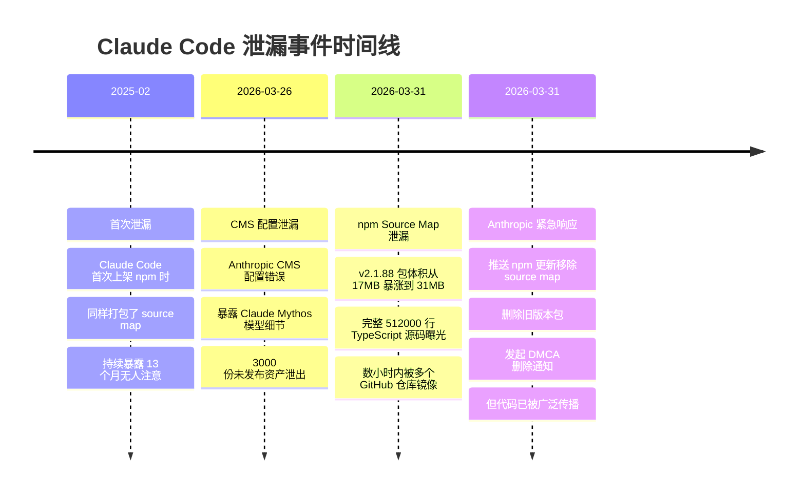

### 1.2 泄漏技术原理

Source map（`.map` 文件）是 JavaScript/TypeScript 构建工具链的标准产物，用于将编译/打包后的代码映射回原始源文件，方便调试时定位到真实代码行。

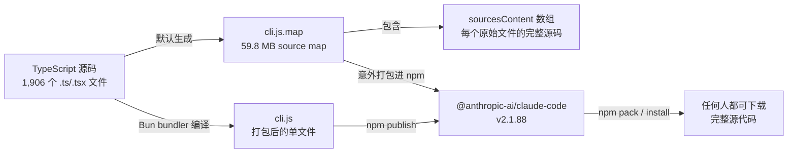

`.map` 文件的结构如下：

```json
{
  "version": 3,
  "sources": ["../src/main.tsx", "../src/tools/BashTool.ts", "..."],
  "sourcesContent": ["// 每个文件的完整原始源码...", "..."],
  "mappings": "AAAA,SAAS,OAAO..."
}
```

Bun bundler 默认生成 source map，除非显式关闭。Anthropic 没有将 `*.map` 加入 `.npmignore`，也没有在构建配置中禁用 source map 生成。讽刺的是，Claude Code 内部有一个叫 **"Undercover Mode"** 的子系统，专门防止 Anthropic 内部信息在 git 提交中泄漏——然而真正的泄漏却来自一个 `.map` 文件。

### 1.3 泄漏规模

| 指标 | 数值 |
|------|------|
| 总代码行数 | **512,000+** |
| 源文件数量 | **1,906** 个 TypeScript/TSX 文件 |
| Source Map 大小 | **59.8 MB** |
| npm 包体积变化 | 17 MB → 31 MB |
| Agent 工具数量 | **~42** 个 |
| Slash 命令数量 | **~85** 个 |
| 内部功能开关 | **44** 个 |
| 核心文件 | QueryEngine.ts (46K行), Tool.ts (29K行), commands.ts (25K行) |

### 1.4 社区反应与 Anthropic 应对

泄漏事件引发了社区的强烈讨论。Reddit、Hacker News 上的反应出奇一致："*The irony is unreal*" —— Anthropic 一直宣传 Claude 在编写和审查代码方面有多强大，结果自家代码因为一个基础错误而泄漏。

**Anthropic 的应对**：
- 立即推送 npm 更新，移除 source map 文件
- 删除旧版本包
- 向 GitHub 镜像仓库发起 DMCA 删除通知
- 官方声明："这是人为造成的发布打包问题，不是安全漏洞"

**社区的不同声音**：

开发者 Skanda 指出："*这次'泄漏'有点标题党。Claude Code CLI 在 npm 包里一直是可读的（minified JS）。Source map 只是让它变成了可读的 TypeScript。*"

```bash
# 实际上，通过以下命令一直可以读到（混淆的）逻辑
cat /opt/homebrew/lib/node_modules/@anthropic-ai/claude-code/dist/*.js
```

但看到代码和理解代码是两回事。这次泄漏让社区得以深入分析 Anthropic 的工程实践。

---

## 第二章：总体架构

### 2.1 这不是 CLI 工具，而是运行平台

大多数人对 AI 编程工具的理解停留在：用户输入 → 调用 LLM API → 返回代码。但 Claude Code 的源码揭示了一个截然不同的真相——这是一个**以 LLM 为内核的操作系统**。

用一个比喻来理解：

| 工具 | 比喻 |
|------|------|
| **Cursor** | 让程序员坐在你旁边，每步操作你看一眼点"允许" |
| **GitHub Copilot Agent** | 给程序员一台新虚拟机随便折腾，搞完提交代码 |
| **Claude Code** | 让程序员直接用你的电脑，但配了一套9层安检系统 |

### 2.2 四大入口

Claude Code 拥有四个独立的入口点，同一个 Agent 运行时可以服务四种交互界面：

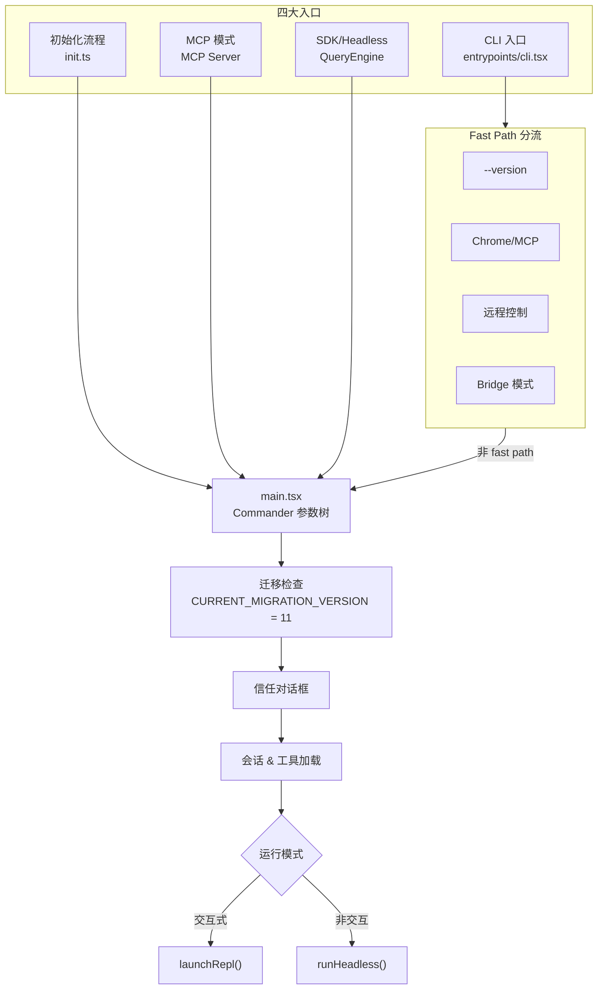

判断非交互模式的条件包括：`-p` 参数、`--init-only`、`--sdk-url`、stdout 非 TTY 等。

### 2.3 分层架构

```mermaid
flowchart TB
    subgraph layer1 ["终端 UI 层"]
        INK["React + Ink 框架"]
        YOGA["Yoga 布局引擎"]
        SCREEN["双缓冲渲染"]
        VIM["Vim 模式"]
        VOICE["语音输入"]
    end

    subgraph layer2 ["主应用层"]
        REPL2["REPL / Headless"]
        CMDS["85+ Slash 命令"]
        PLUGINS["插件 / Skills"]
        KEYBIND["快捷键系统"]
    end

    subgraph layer3 ["查询引擎层"]
        QUERY["query() 异步生成器"]
        STREAM["流式 API 通信"]
        TOOLEXEC["工具执行引擎"]
        COMPACT["Compaction 压缩"]
        COST["成本 & Token 追踪"]
    end

    subgraph layer4 ["工具子系统"]
        TOOLS["42 个 Agent 工具"]
        PERM["权限系统"]
        SANDBOX["沙箱隔离"]
        HOOKS["Hook 生命周期"]
    end

    subgraph layer5 ["服务层"]
        API["Claude API 客户端"]
        ANALYTICS["Analytics / 遥测"]
        SESSION["会话持久化"]
        MEMORY["记忆 / autoDream"]
        MCPSVC["MCP 服务"]
    end

    subgraph layer6 ["传输层"]
        LOCAL["本地 CLI"]
        BRIDGESVC["Bridge 远程"]
        DIRECTCONN["IDE Direct Connect"]
        TRANSPORT["SSE / WebSocket / Hybrid"]
    end

    layer1 --> layer2
    layer2 --> layer3
    layer3 --> layer4
    layer4 --> layer5
    layer5 --> layer6
```

### 2.4 技术栈

| 类别 | 技术 |
|------|------|
| 语言 | **TypeScript**（严格模式） |
| 运行时 | **Bun** |
| 终端 UI | **React + Ink**（自定义 reconciler） |
| 布局引擎 | **Yoga**（Flexbox） |
| API 通信 | Claude Messages API + SSE 流式 |
| 构建工具 | Bun bundler |
| 功能开关 | **GrowthBook** + **Statsig** |
| 遥测 | **Datadog** + **Perfetto** |
| 缓存 | Prompt Cache（字节级前缀匹配） |

### 2.5 核心数据流

一次完整的用户交互经历以下流程：

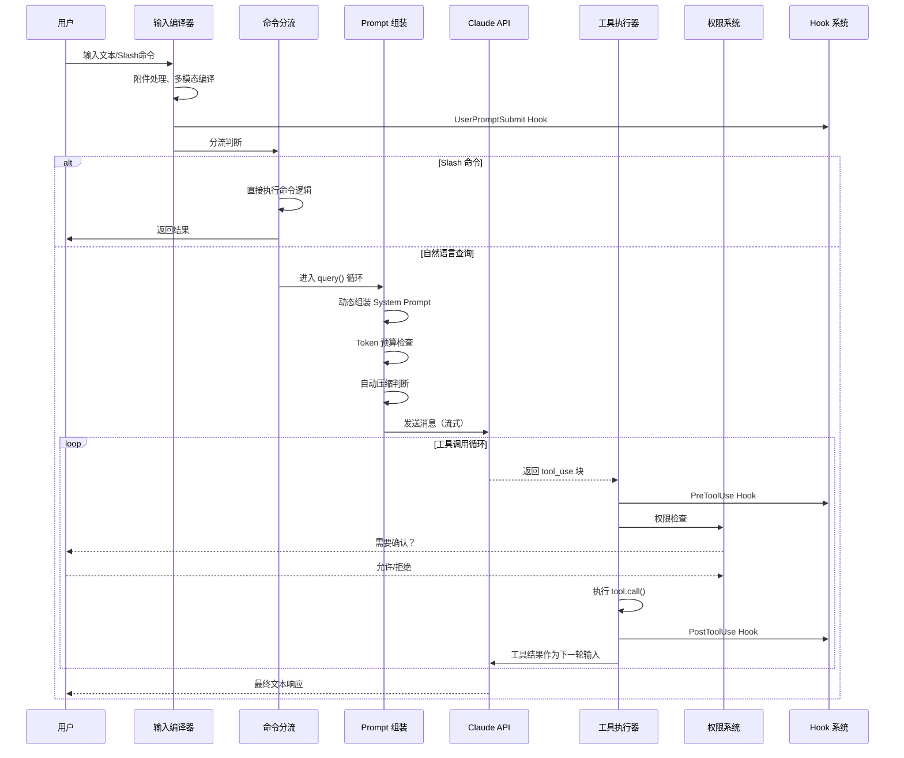

---

## 第三章：查询引擎与主循环

### 3.1 query() 异步生成器

查询引擎的核心是一个名为 `query()` 的**异步生成器函数**（在压缩代码中标识为 `tt` / `po_`），它编排了每一次 AI 交互的完整生命周期。

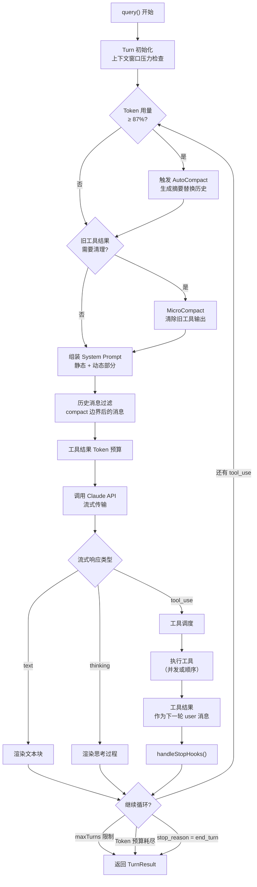

### 3.2 Think → Act → Observe 循环

Claude Code 的主循环遵循经典的 **Think → Act → Observe** 模式，但在工程实现上做了大量优化：

| 阶段 | 实现 | 关键细节 |
|------|------|----------|
| **Think** | 动态 System Prompt 组装 | 每轮重新构建，包含工具规格、目录结构、git 上下文 |
| **Act** | 工具执行引擎 | 支持并发执行、流式工具、批次处理 |
| **Observe** | 工具结果注入 | 结果作为下一轮 user 消息，自动 Token 预算控制 |

核心设计哲学是 **"少搭框架，多信模型"**（Less scaffolding, more model）——没有 DAG、没有分类器，模型自己决定下一步做什么。

### 3.3 Token 预算管理

Token 预算管理是 Claude Code 的关键工程挑战。200K 的上下文窗口需要在多个部分之间共享：

```
┌──────────────────────────────────────────────┐
│              200K Token 上下文窗口              │
├──────────────────────────────────────────────┤
│  System Prompt（动态组装）         ~15-25K    │
│  ────────────────────────────────────────     │
│  对话历史（经压缩管理）            ~100-150K   │
│  ────────────────────────────────────────     │
│  工具结果（带预算控制）            ~20-30K     │
│  ────────────────────────────────────────     │
│  响应缓冲区                       ~10-20K     │
└──────────────────────────────────────────────┘
```

`tokenBudget.ts` 实现了独立于 API `task_budget` 的客户端预算控制：
- **+500K 自动续期**：当消耗达到预算时自动扩展
- **90% 消耗停止**：接近预算上限时终止循环
- **收益递减检测**：连续低增量被视为收益递减，提前终止

### 3.4 SDK 控制协议

`QueryEngine` 暴露了一套完整的 SDK 控制协议（`controlSchemas.ts`），通过 stdin/stdout 上的 JSON 消息实现 Headless/SDK 进程与 CLI 之间的通信：

| 控制消息类型 | 功能 |
|-------------|------|
| `init` | 初始化会话 |
| `interrupt` | 中断当前执行 |
| `can_use_tool` | 工具使用权限查询 |
| `permission_mode` | 权限模式切换 |
| `model` | 模型选择 |
| `mcp_status` | MCP 状态查询 |
| `get_context_usage` | 上下文使用量（含 MCP、memory、agents 等细分） |
| `rewind` | 回退消息 |
| `cron_task` | 定时任务管理 |
| `elicitation` | 信息引导获取 |

---

## 第四章：系统提示词工程

### 4.1 动态组装机制

Claude Code 的 System Prompt 不是一段固定文本，而是由 `getSystemPrompt()` 函数**动态拼装**的。拼装逻辑分为**静态部分**和**动态部分**，中间由 `SYSTEM_PROMPT_DYNAMIC_BOUNDARY` 标记分隔。

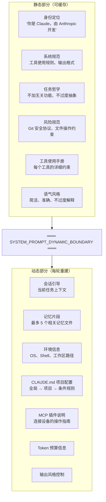

### 4.2 缓存策略与 Token 经济学

这个设计的核心秘密在于**缓存经济学**：

- **边界之上（静态部分）**：内容不变，API 可以完美缓存，实现 **92% 的前缀复用率**
- **边界之下（动态部分）**：每次对话不同，确保环境感知

在实际的 API 请求中，Prompt 经历三层处理：

| 层级 | 内容 | 说明 |
|------|------|------|
| **Prompt 文本层** | System Prompt 文本 | 静态/动态分离 |
| **Schema 请求层** | 工具定义、模型参数 | `_I4 → _X → LZz → hZz` 链 |
| **传输层** | HTTP 请求 | SSE 流式、重试策略 |

为了最大化缓存命中率，子 Agent（Fork）统一使用 `'Fork started — processing in background'` 作为文本前缀，利用字节级前缀匹配让后续 9 个子 Agent 复用第一个的缓存。

### 4.3 CLAUDE.md 分层加载

项目上下文通过 `CLAUDE.md` 文件注入，遵循分层加载机制：

```
~/.claude/CLAUDE.md          ← 全局配置（用户偏好）
./CLAUDE.md                  ← 项目根配置
./.claude/rules/*.md         ← 条件规则文件
./子目录/CLAUDE.md            ← 子目录特定配置
```

关键细节：CLAUDE.md 的内容被注入到**用户消息**中（包裹在 XML 标签内），而不是 System Prompt 中。这是一个刻意的设计——将项目上下文放在用户消息中可以保持 System Prompt 的稳定性，从而最大化 prompt cache 命中率。

### 4.4 行为约束体系

源码中的行为约束被写成"铁律"，极其严格：

**任务哲学**（`getSimpleDoingTasksSection()`）：

```
- 不要添加用户没要求的功能
- 不要过度抽象，不要擅自重构
- 不要乱加注释和文档字符串
- 不要给时间估计
- 方法失败时先诊断原因再换策略
- 结果要如实汇报，不能假装自己测试过了
```

**工具使用语法**：

```
- 读文件必须用 FileRead，不许用 cat/head/tail
- 改文件必须用 FileEdit，不许用 sed/awk
- 没有依赖关系的工具调用必须并行处理
```

**Git 安全协议**：

```
- 绝不擅自 git push --force 或 reset --hard
- 总是创建新 commit 而不是 amending
- 不要跳过 hooks（--no-verify）
```

---

## 第五章：工具系统

### 5.1 工具类型契约

Claude Code 的每个工具都遵循严格的类型契约，定义在 `Tool` 接口中：

```typescript
interface Tool {
  // 身份
  name: string;
  isMcp: boolean;
  alwaysLoad: boolean;
  shouldDefer: boolean;      // 延迟加载以节省 Token

  // Schema
  inputSchema: ZodSchema;
  outputSchema?: ZodSchema;

  // 能力声明
  isEnabled(): boolean;
  isConcurrencySafe: boolean; // 默认 false（Fail-closed）
  isReadOnly: boolean;        // 默认 false（Fail-closed）
  isDestructive: boolean;

  // 生命周期
  checkPermissions(): PermissionDecision;
  call(input, context): ToolResult;

  // 自动分类器输入
  toAutoClassifierInput(): ClassifierInput;
}
```

**Fail-closed 设计**：`isConcurrencySafe` 和 `isReadOnly` 默认都是 `false`。如果开发者忘了声明安全属性，系统宁可误杀，也会将其视为"有风险、会写入"的工具。

### 5.2 42 个工具一览

| 类别 | 工具 | 说明 |
|------|------|------|
| **文件操作** | FileRead, FileWrite, FileEdit | 读前写约束、mtime 一致性 |
| **搜索** | Grep, Glob, ToolSearch | ripgrep 替代 RAG |
| **执行** | Bash, SleepTool | 沙箱隔离、超时控制 |
| **代理** | Agent (Task), TodoWrite | 子代理生成、任务管理 |
| **Web** | WebFetch, WebSearch | 网页抓取、搜索 |
| **笔记本** | NotebookRead, NotebookEdit | Jupyter 支持 |
| **MCP** | MCPTool (mcp__server__tool) | 动态工具协议 |
| **计划** | EnterPlanMode, ExitPlanMode | 计划模式切换 |
| **定时** | CronCreate, CronDelete, CronList | KAIROS 守护进程 |
| **其他** | LSPTool, MemoryTool 等 | IDE 集成、记忆管理 |

### 5.3 14 步工具执行治理流水线

每次工具调用都要经过 14 步严格的治理流水线：

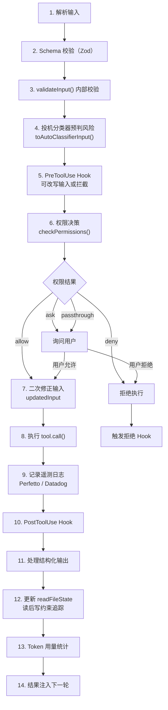

### 5.4 核心工具详解

#### BashTool —— 沙箱机制

Bash 工具是最危险也最强大的工具，配备了多层安全防护：

```
┌─ BashTool 安全层 ────────────────────────────────┐
│                                                    │
│  ┌─ 超时控制 ───────────────────────────────────┐ │
│  │  默认超时 / 后台任务支持                       │ │
│  │  Assistant 模式限制 15 秒                     │ │
│  │  禁止滥用 sleep，引导使用 SleepTool            │ │
│  └───────────────────────────────────────────────┘ │
│                                                    │
│  ┌─ 沙箱隔离 ───────────────────────────────────┐ │
│  │  Linux: bubblewrap (bwrap)                    │ │
│  │  macOS: sandbox-exec                          │ │
│  │  可通过 dangerouslyDisableSandbox 关闭        │ │
│  └───────────────────────────────────────────────┘ │
│                                                    │
│  ┌─ CWD 追踪 ──────────────────────────────────┐ │
│  │  Shell.ts 核心：工作目录追踪                   │ │
│  │  文件模式 / 管道模式切换                       │ │
│  └───────────────────────────────────────────────┘ │
│                                                    │
└────────────────────────────────────────────────────┘
```

#### FileRead / FileWrite / FileEdit —— 读前写约束

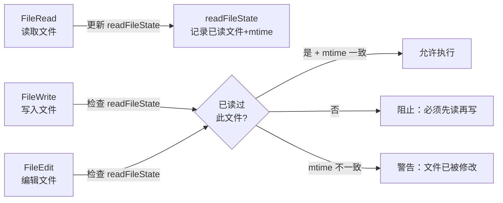

### 5.5 ToolSearch 延迟加载

为节省 Token，42 个工具并非全部加载。`shouldDefer` 标记的工具通过 `ToolSearch` 按需注入：

1. 用户查询触发 → 模型判断需要某工具
2. 模型调用 `ToolSearch`（`select:name` 精确加载或模糊打分）
3. 匹配结果作为 `tool_reference` 注入上下文
4. 后续轮次可使用该工具

---

## 第六章：多Agent蜂群架构

### 6.1 六个内建 Agent

Claude Code 在任务复杂时不会单打独斗，而是生成子 Agent 蜂群（Swarm）。源码确认了至少六个内建 Agent 角色：

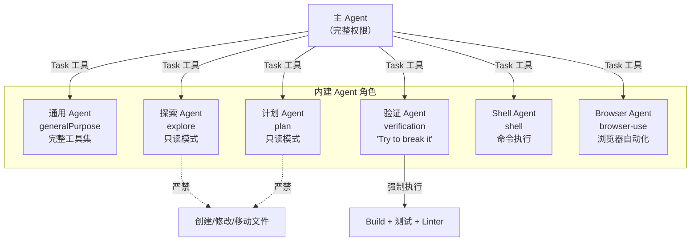

### 6.2 角色隔离原则

**Explore Agent 和 Plan Agent** 被设计为纯只读模式：
- 不能创建、修改或移动文件
- Bash 工具限制为 `ls`、`git status` 等安全操作
- 计划和实现**彻底分离**，防止 AI 在探索阶段不小心改坏代码

**反偷懒机制**：
- 主 Agent 派发任务时**禁止**写模糊指令（如"基于你的发现去修 bug"），必须给出具体的文件路径和行号
- 子 Agent 启动时被注入**压迫性指令**："你是一个被 Fork 出来的工人，不是经理。不要交流提问，直接使用工具干活，严禁再生成子 Agent。"

### 6.3 Coordinator 协调器模式

在 Coordinator 模式下，主 Agent 变身项目经理，遵循四阶段工作流：

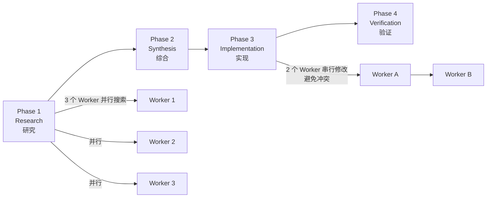

通过环境变量 `CLAUDE_CODE_COORDINATOR_MODE` 和 GrowthBook 功能开关 `COORDINATOR_MODE` 控制。协调器注入 `getCoordinatorUserContext`，提供 worker 工具集和 scratchpad（`tengu_scratch`）。

### 6.4 Verification Agent —— 全场最佳设计

Verification Agent 的设计可能是整个系统里**最值钱的逻辑**。其核心目标被完全逆转：

```
核心方向：Try to break it（想办法搞坏它）

强制要求：
├── 运行 Build 检查
├── 运行完整测试套件
├── 运行 Linter 和类型检查
├── 前端改动 → 浏览器自动化验证
├── 后端改动 → curl 实测响应
└── 主动进行对抗性探测（Adversarial probes）

最终判决：PASS / FAIL / PARTIAL

设计原则：
├── 与"写代码的 Agent"利益彻底隔离
├── 没有"自己写得很棒"的偏见
└── 严厉禁止"只看代码不跑检查"的逃避行为
```

### 6.5 Fork 缓存优化

所有 Fork 出来的子 Agent 统一使用相同的文本前缀：

```
'Fork started — processing in background'
```

这利用了 API 的字节级前缀匹配机制——第一个子 Agent 的 prompt 被缓存后，后续 9 个子 Agent 可以直接复用该缓存，大幅削减 API 调用成本。

---

## 第七章：上下文管理与压缩

### 7.1 三层压缩机制

长对话必然导致 Token 爆炸。Claude Code 通过三层压缩机制实现"永不超限"：

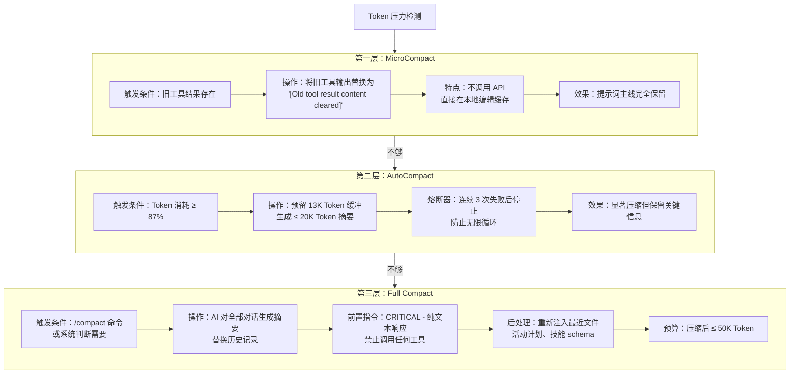

### 7.2 记忆系统

Claude Code 让用户感觉"它认识你"，依赖一套精密的记忆管理系统：

**双模型协同检索**：不使用传统的向量搜索（早期版本使用 Voyage embeddings 的 RAG 方案已被放弃），而是调用一个快速的 AI 模型（如 Claude Sonnet）扫描所有记忆文件的标题和描述，选出最多 **5 个**最相关的记忆注入上下文。策略是"**精确度优先于召回率**"，宁可漏掉也不塞入无关信息。

**记忆层级**：

```
~/.claude/MEMORY.md         ← 全局记忆
./.claude/memory/*.md       ← 项目级记忆
./.claude/sessions/*.json   ← 会话记录
```

### 7.3 autoDream / KAIROS 夜间记忆蒸馏

这是 Claude Code 中最具科幻感的功能之一：

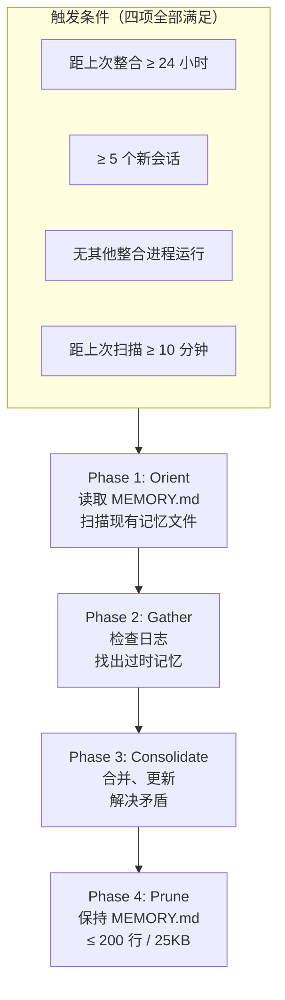

在长会话中，记忆最初只作为按日期的追加式日志（流水账）存在。当系统处于低活跃期，会触发 `/dream` 技能。AI 在"睡觉"时，将原始日志**蒸馏压缩**成结构化的"用户偏好"和"项目背景"文件——仿生学意义上的"记忆巩固"。

---

## 第八章：权限与安全

### 8.1 权限决策模型

工具的权限决策有四种结果：

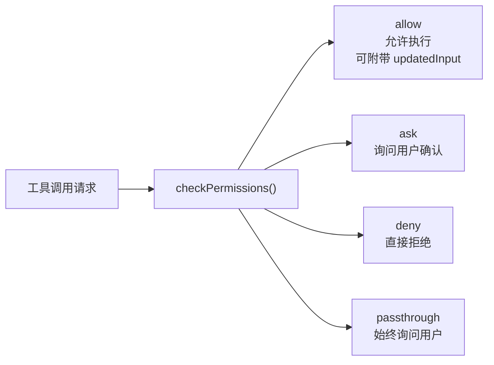

权限决策链路中还包含**自动分类器**（`toAutoClassifierInput()`），它会对工具调用进行风险预判，辅助权限系统做出决策。

### 8.2 Hook 系统

Claude Code 实现了 **104 个 React Hooks** 和一套 **运行时 Hook 事件**（`HOOK_EVENTS`），两者互补：

| 类型 | 位置 | 代表性 Hook |
|------|------|------------|
| **运行时 Hook** | `query()` 循环内 | `InstructionsLoaded`, `UserPromptSubmit`, `PreToolUse`, `PostToolUse`, `PostCompact` |
| **React Hook** | UI 组件内 | `useCommandQueue`, `useToolPermission`, `useSwarm`, `useRemoteSession` |

Hook 四阶段时序：

```
1. sj() → Di6(...) InstructionsLoaded     ← 指令加载完成
2. AU8 → ihz → qe1(...) UserPromptSubmit  ← 用户输入提交
3. tool_use → qs1(...) PreToolUse          ← 工具使用前
4. permission core → PermissionRequest     ← 权限请求（需要时）
```

### 8.3 沙箱机制

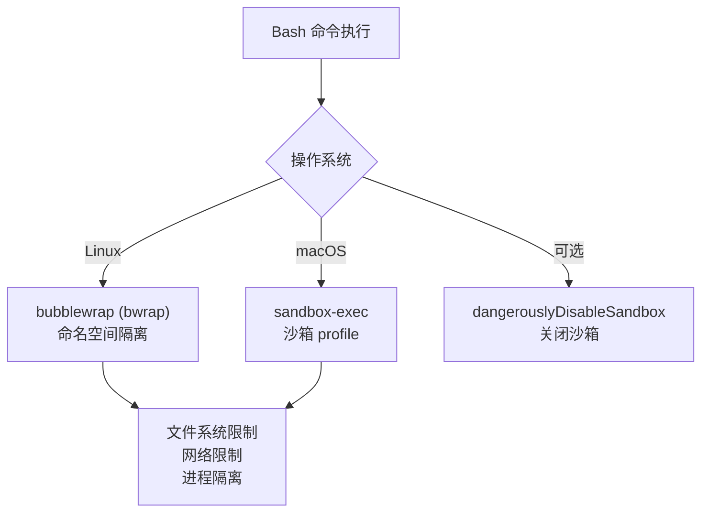

### 8.4 Undercover Mode

源码揭示了一个名为 **"Undercover Mode"** 的系统：当 Anthropic 员工使用 Claude Code 向开源项目贡献代码时，该模式自动启用，**剥除所有 Anthropic 相关的归属信息**。

判断条件：`USER_TYPE === 'ant'`（Anthropic 内部员工）

该模式会：
- 在 git 提交中隐藏 AI 工具使用痕迹
- 移除 Anthropic 相关的元数据
- 防止内部模型代号和功能名称泄漏

讽刺的是，这个防止泄漏的系统本身在这次事件中被泄漏了。

---

## 第九章：生态系统

### 9.1 MCP 协议集成

MCP（Model Context Protocol）是 Claude Code 扩展能力的核心协议：

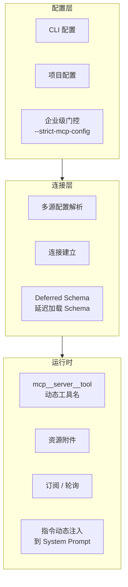

当 MCP 设备连接时，其附带的操作指南（`instructions`）会被动态拼接到 System Prompt 中。模型不仅获得了新工具，还实时拿到了"使用说明书"。

### 9.2 三套扩展机制

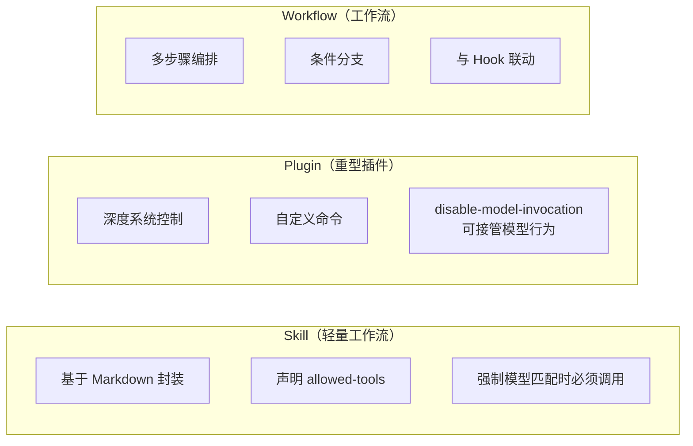

命令注册顺序：`bundled skills → builtin plugin skills → skill 目录 → workflow → plugin`

### 9.3 Bridge 远程会话

Claude Code 支持四条远程路径：

| 路径 | 模式 | 说明 |
|------|------|------|
| `--remote-control` | 本地会话对外 bridge | 将本地会话暴露给远端 |
| `--remote` | 远端 session 前端 | 连接远端会话 |
| `--sdk-url` + headless | SDK transport | SDK 传输通道 |
| `useDirectConnect` | 裸 WebSocket | IDE 直连 |

Bridge 协议有两个版本：

- **V1**：基于 Environments API + 轮询
- **V2**（env-less）：`POST /v1/code/sessions` → bridge，仅 REPL，受 GrowthBook `tengu_bridge_repl_v2` 门控

核心数据结构 `WorkSecret` 包含：JWT session ingress、API base、git 源、环境变量、MCP 配置等。

### 9.4 TUI 终端界面

Claude Code 的终端 UI 不是简单的文本输出，而是一个完整的 **React 应用**：

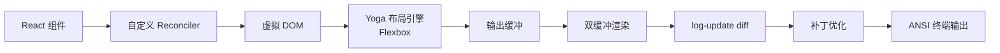

渲染流水线：React 组件 → 自定义 reconciler → 虚拟 DOM → Yoga 布局 → 输出缓冲 → 双缓冲 → diff → 补丁 → ANSI 写出。渲染节流约 16ms（≈60fps）。

`Ink` 类还提供：焦点管理、文本选择与高亮、搜索 overlay、alt-screen 模式、鼠标追踪等功能。

---

## 第十章：隐藏功能与彩蛋

### 10.1 BUDDY 数字宠物系统

源码中最令人意外的发现是一个完整的**数字宠物系统**，藏在 `buddy/` 目录中：

```
buddy/
├── CompanionBones.ts    ← 确定性骨骼生成（userId + salt 的 Mulberry32）
├── CompanionSoul.ts     ← 持久化状态
├── species.ts           ← 物种名（fromCharCode 混淆）
├── rarity.ts            ← 稀有度分级
├── shiny.ts             ← 闪光变体
├── stats.ts             ← 程序化生成属性
└── ascii-sprites/       ← ASCII 精灵图
```

- 类似 OpenClaw 的宠物收集系统
- 基于 `userId + salt` 使用 **Mulberry32** 算法确定性生成
- 有稀有度分级和闪光变体
- 锁定在编译时功能开关 `BUDDY` 后面
- 计划发布日期：2026年4月1-7日预告窗口，5月正式上线

### 10.2 KAIROS 守护进程

KAIROS 是一个让 Claude Code 在后台持续运行的守护进程模式：

- 通过 `CronCreate`、`CronDelete`、`CronList` 工具管理定时任务
- 持久化存储（durable）
- 支持 cron 表达式和人类可读描述
- 受 GrowthBook 功能开关 `KAIROS` 门控
- 与 autoDream 记忆整合系统联动

### 10.3 44 个编译时功能开关

源码揭露了 44 个隐藏的功能开关，通过 GrowthBook 和 Statsig 管理：

| 功能开关 | 说明 |
|---------|------|
| `PROACTIVE` | 主动式交互 |
| `VOICE_MODE` | 语音输入模式 |
| `BRIDGE_MODE` | Bridge 远程模式 |
| `KAIROS` | 守护进程/定时任务 |
| `BUDDY` | 数字宠物系统 |
| `COORDINATOR_MODE` | 多 Agent 协调器 |
| `tengu_bridge_repl_v2` | Bridge V2 协议 |
| `tengu_scratch` | Scratchpad 功能 |
| `CLAUDE_CODE_SIMPLE` | 简化三工具模式 |
| ... | 另有 35+ 未公开开关 |

### 10.4 未发布模型代号

源码中引用了三个内部模型代号：

| 代号 | 推测 |
|------|------|
| **Capybara** | 下一代推理模型 |
| **Fennec** | 轻量级快速模型 |
| **Numbat** | 特殊用途模型 |

这些代号与 `betas.ts` 中的 beta 字符串集合以及 Bedrock/Vertex 对 beta 的允许集合相关联。

---

## 第十一章：总结与启示

### 11.1 AI Agent 的壁垒在哪里

看完这 512,000 行代码，一个核心结论浮出水面：**AI Agent 90% 的工作量都在"AI"之外**。

```
512,000 行代码的分布：
├── 模型调用 & API 通信    ~5%
├── 工具系统 & 权限管理    ~25%
├── 上下文工程 & 压缩      ~15%
├── UI/UX & 终端渲染       ~20%
├── 生态集成 & 扩展        ~15%
├── 会话管理 & 持久化      ~10%
└── 遥测 & 监控 & 安全     ~10%
```

真正的壁垒不在于"调用 AI"，而在于：

1. **信任工程**：如何让 AI 在真实环境中安全运行——42 个工具的 14 步治理流水线、Fail-closed 设计、读前写约束
2. **上下文经济学**：如何在 200K Token 窗口内精打细算——三层压缩、延迟工具加载、prompt cache 优化
3. **多 Agent 编排**：如何让多个 AI 协同工作又互不干扰——角色隔离、Verification Agent、Fork 缓存优化
4. **产品化打磨**：从进程管理、错误恢复到遥测追踪的"最后一公里"

### 11.2 可借鉴的工程实践

| 实践 | 说明 | 适用场景 |
|------|------|----------|
| **System Prompt 静态/动态分离** | 缓存不变部分，节省 92% Token 成本 | 所有 LLM 应用 |
| **Fail-closed 安全设计** | 默认假设工具有风险 | AI Agent 开发 |
| **三层上下文压缩** | MicroCompact → AutoCompact → Full | 长对话 AI 应用 |
| **Verification Agent** | 独立验证、利益隔离 | 代码生成系统 |
| **读前写约束** | 防止盲目修改 | 文件操作工具 |
| **Fork 缓存前缀** | 统一前缀最大化 cache 命中 | 多 Agent 系统 |
| **autoDream 记忆整合** | 定期蒸馏流水账为结构化知识 | 需要长期记忆的 AI 应用 |
| **ToolSearch 延迟加载** | 按需注入工具定义节省 Token | 工具数量多的 Agent |

### 11.3 与其他 AI 编程工具的对比

```
┌──────────────────────────────────────────────────────────────┐
│                    AI 编程工具对比                             │
├──────────┬──────────┬──────────────┬─────────────────────────┤
│ 维度      │ Cursor   │ Copilot Agent │ Claude Code           │
├──────────┼──────────┼──────────────┼─────────────────────────┤
│ 运行环境  │ IDE 内    │ 云端虚拟机    │ 用户本地终端            │
│ 安全模型  │ 逐步确认  │ 完全隔离     │ 多层权限 + 沙箱         │
│ Agent 架构│ 单 Agent  │ 单 Agent     │ 蜂群 + 协调器          │
│ 上下文管理│ IDE 集成  │ 文件快照     │ 三层压缩 + 记忆蒸馏     │
│ 验证机制  │ 用户审查  │ CI/CD       │ Verification Agent     │
│ 扩展性    │ 插件市场  │ Actions     │ MCP + Skill + Plugin   │
│ 搜索策略  │ 向量索引  │ 向量索引     │ ripgrep 代理式搜索      │
│ 工具数量  │ ~10      │ ~15         │ 42+                    │
│ 终端 UI   │ N/A      │ N/A         │ React + Ink（60fps）   │
└──────────┴──────────┴──────────────┴─────────────────────────┘
```

### 11.4 最后的思考

> *"Even the most powerful AI companies are built by humans. They make basic mistakes. They hide easter eggs in code. They secretly prepare digital pet systems before April Fools'."*

这次泄漏事件告诉我们：

1. **没有魔法，只有工程**：1,906 个文件、512,000 行代码、无数个深夜的重构——AI 工具背后是真实的工程师在解决真实的问题。
2. **核心护城河在模型**：正如开发者 Skanda 所说，你可以复制架构，可以学习工程实践，但你无法复刻 Claude 的推理能力。CLI 工具是载体，模型才是灵魂。
3. **供应链安全永远重要**：一个 `.map` 文件就能暴露整个代码库。Source map、API key、调试配置——任何一个环节的疏忽都可能导致知识产权灾难。

---

## 参考资源

### 分析仓库（已收录）

| 仓库 | Stars | 说明 |
|------|-------|------|
| [instructkr/claude-code](https://github.com/instructkr/claude-code) | 53K+ | Python 移植 + 核心架构分析 |
| [hitmux/HitCC](https://github.com/hitmux/HitCC) | 600+ | 完整逆向工程文档（v2.1.84） |
| [Kuberwastaken/claude-code](https://github.com/Kuberwastaken/claude-code) | 2.8K+ | Rust 清洁室重实现 + 13 份规格说明 |
| [Prajwalsrinvas/claude-code-reverse-engineering](https://github.com/Prajwalsrinvas/claude-code-reverse-engineering) | — | 逆向工程分析 |

### 分析文章

| 文章 | 作者/来源 |
|------|----------|
| [Claude Code's Entire Source Code Just Leaked — 512,000 Lines Exposed](https://dev.to/evan-dong/claude-codes-entire-source-code-just-leaked-512000-lines-exposed-3139) | Evan Dong / DEV.to |
| [51万行源码泄露：全面解构 Claude Code](https://dev.to/white_satomini/51mo-xing-yuan-ma-xie-lu-quan-mian-jie-gou-claude-code-ru-he-cheng-wei-ai-bian-cheng-tian-hua-ban-1cgn) | WarpNav / DEV.to |
| [I Analyzed All 512,000 Lines — Here's What Anthropic Was Hiding](https://dev.to/vibehackers/i-analyzed-all-512000-lines-of-claude-codes-leaked-source-heres-what-anthropic-was-hiding-4gg8) | VibeHackers / DEV.to |
| [How Claude Code Works: Architecture & Internals](https://cc.bruniaux.com/guide/architecture/) | Claude Code Guide |
| [How Claude Code Actually Works: A Systems-Level Deep Dive](https://karaxai.com/posts/how-claude-code-works-systems-deep-dive/) | KaraxAI |
| [Architecture: The Engine Room](https://www.southbridge.ai/blog/claude-code-an-analysis-architecture) | Southbridge.AI |
| [揭秘 Claude Code 底层的上下文工程与复用模式](https://blog.lmcache.ai/zh/2025/12/31/揭秘-claude-code-底层的上下文工程与复用模式/) | LMCache Blog |

### 相关链接

- [原始发现推文 (Chaofan Shou)](https://x.com/Fried_rice/status/2038894956459290963)
- [Hacker News 讨论](https://news.ycombinator.com/item?id=47584540)
- [Anthropic 官方 GitHub](https://github.com/anthropics/claude-code)

---

<p align="center">
  <i>本报告基于公开可获取的信息整理，仅用于技术分析和学习目的。</i><br/>
  <i>报告生成时间：2026年4月1日</i>
</p>
