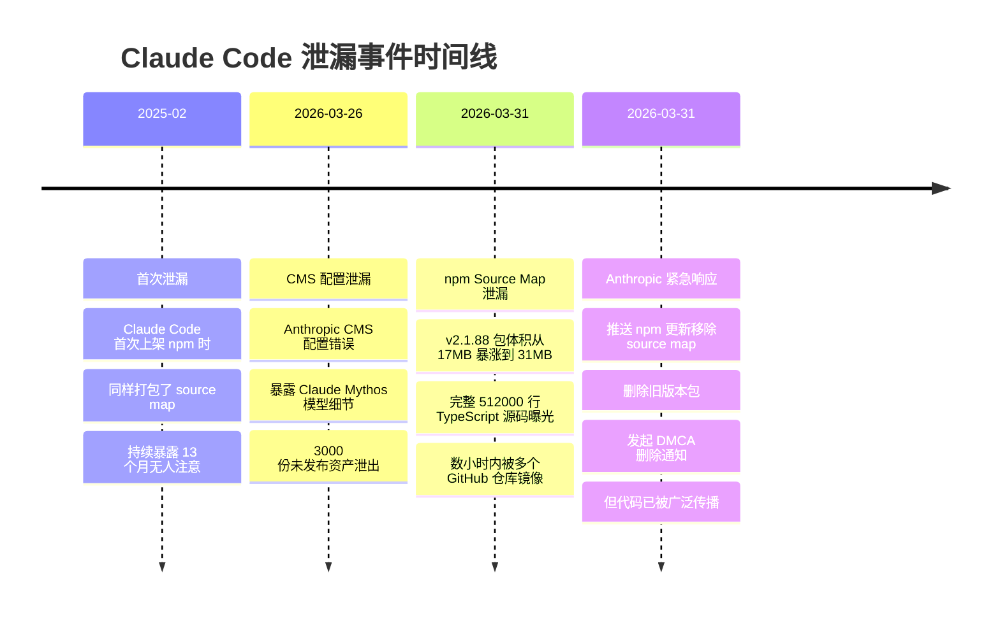
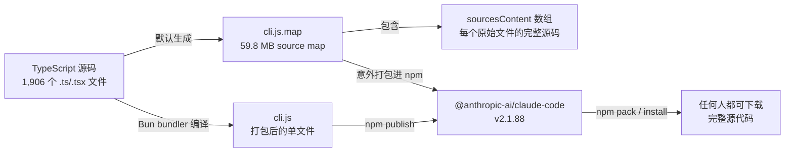

# 第一章：事件背景

[← 返回目录](README.md) | [下一章 →](02-总体架构.md)

---

## 1.1 泄漏事件时间线

2026年3月31日凌晨，安全研究者 **Chaofan Shou** 在 X（原 Twitter）上发布了一条震惊整个 AI 开发社区的消息：

> *"Claude code source code has been leaked via a map file in their npm registry!"*

Anthropic 发布到 npm 的 Claude Code 包（`@anthropic-ai/claude-code` v2.1.88）中，意外打包了一个 59.8 MB 的 source map 调试文件（`cli.js.map`），其中包含了完整的、未混淆的 TypeScript 原始源码。



## 1.2 泄漏技术原理

Source map（`.map` 文件）是 JavaScript/TypeScript 构建工具链的标准产物，用于将编译/打包后的代码映射回原始源文件。



`.map` 文件的结构如下：

```json
{
  "version": 3,
  "sources": ["../src/main.tsx", "../src/tools/BashTool.ts", "..."],
  "sourcesContent": ["// 每个文件的完整原始源码...", "..."],
  "mappings": "AAAA,SAAS,OAAO..."
}
```

Bun bundler 默认生成 source map，除非显式关闭。Anthropic 没有将 `*.map` 加入 `.npmignore`，也没有在构建配置中禁用 source map 生成。

讽刺的是，Claude Code 内部有一个叫 **"Undercover Mode"** 的子系统，专门防止 Anthropic 内部信息在 git 提交中泄漏——然而真正的泄漏却来自一个 `.map` 文件。

## 1.3 泄漏规模

| 指标 | 数值 |
|------|------|
| 总代码行数 | **512,000+** |
| 源文件数量 | **1,906** 个 TypeScript/TSX 文件 |
| Source Map 大小 | **59.8 MB** |
| npm 包体积变化 | 17 MB → 31 MB |
| Agent 工具数量 | **~42** 个 |
| Slash 命令数量 | **~85** 个 |
| 内部功能开关 | **44** 个 |
| 核心文件 | QueryEngine.ts (46K行), Tool.ts (29K行), commands.ts (25K行) |

## 1.4 社区反应与 Anthropic 应对

泄漏事件引发了社区的强烈讨论。Reddit、Hacker News 上的反应出奇一致：

> *"The irony is unreal"* —— Anthropic 一直宣传 Claude 在编写和审查代码方面有多强大，结果自家代码因为一个基础错误而泄漏。

**Anthropic 的应对**：
- 立即推送 npm 更新，移除 source map 文件
- 删除旧版本包
- 向 GitHub 镜像仓库发起 DMCA 删除通知
- 官方声明："这是人为造成的发布打包问题，不是安全漏洞"

**社区的不同声音**：

开发者 Skanda 指出：*这次'泄漏'有点标题党。Claude Code CLI 在 npm 包里一直是可读的（minified JS）。Source map 只是让它变成了可读的 TypeScript。*

但看到代码和理解代码是两回事。这次泄漏让社区得以深入分析 Anthropic 的工程实践。

---

[← 返回目录](README.md) | [下一章：总体架构 →](02-总体架构.md)
