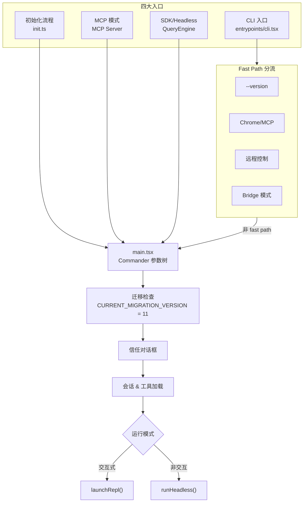
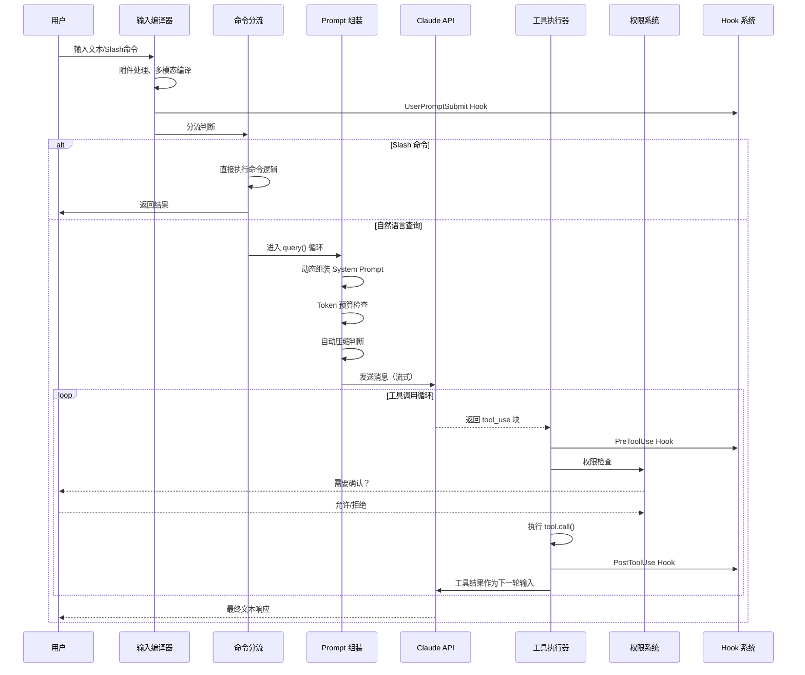

# 第二章：总体架构

[← 上一章](01-事件背景.md) | [返回目录](README.md) | [下一章 →](03-查询引擎与主循环.md)

---

## 2.1 这不是 CLI 工具，而是运行平台

大多数人对 AI 编程工具的理解停留在：用户输入 → 调用 LLM API → 返回代码。但 Claude Code 的源码揭示了一个截然不同的真相——这是一个**以 LLM 为内核的操作系统**。

| 工具 | 比喻 |
|------|------|
| **Cursor** | 让程序员坐在你旁边，每步操作你看一眼点"允许" |
| **GitHub Copilot Agent** | 给程序员一台新虚拟机随便折腾，搞完提交代码 |
| **Claude Code** | 让程序员直接用你的电脑，但配了一套9层安检系统 |

## 2.2 四大入口

Claude Code 拥有四个独立的入口点，同一个 Agent 运行时可以服务四种交互界面：

## 2.3 分层架构

```mermaid
flowchart TB
    subgraph layer1 ["终端 UI 层"]
        INK["React + Ink 框架"]
        YOGA["Yoga 布局引擎"]
        SCREEN["双缓冲渲染"]
        VIM["Vim 模式"]
        VOICE["语音输入"]
    end

    subgraph layer2 ["主应用层"]
        REPL2["REPL / Headless"]
        CMDS["85+ Slash 命令"]
        PLUGINS["插件 / Skills"]
        KEYBIND["快捷键系统"]
    end

    subgraph layer3 ["查询引擎层"]
        QUERY["query() 异步生成器"]
        STREAM["流式 API 通信"]
        TOOLEXEC["工具执行引擎"]
        COMPACT["Compaction 压缩"]
        COST["成本 & Token 追踪"]
    end

    subgraph layer4 ["工具子系统"]
        TOOLS["42 个 Agent 工具"]
        PERM["权限系统"]
        SANDBOX["沙箱隔离"]
        HOOKS["Hook 生命周期"]
    end

    subgraph layer5 ["服务层"]
        API["Claude API 客户端"]
        ANALYTICS["Analytics / 遥测"]
        SESSION["会话持久化"]
        MEMORY["记忆 / autoDream"]
        MCPSVC["MCP 服务"]
    end

    subgraph layer6 ["传输层"]
        LOCAL["本地 CLI"]
        BRIDGESVC["Bridge 远程"]
        DIRECTCONN["IDE Direct Connect"]
        TRANSPORT["SSE / WebSocket / Hybrid"]
    end

    layer1 --> layer2
    layer2 --> layer3
    layer3 --> layer4
    layer4 --> layer5
    layer5 --> layer6
```

## 2.4 技术栈

| 类别 | 技术 |
|------|------|
| 语言 | **TypeScript**（严格模式） |
| 运行时 | **Bun** |
| 终端 UI | **React + Ink**（自定义 reconciler） |
| 布局引擎 | **Yoga**（Flexbox） |
| API 通信 | Claude Messages API + SSE 流式 |
| 构建工具 | Bun bundler |
| 功能开关 | **GrowthBook** + **Statsig** |
| 遥测 | **Datadog** + **Perfetto** |
| 缓存 | Prompt Cache（字节级前缀匹配） |

## 2.5 核心数据流

---

[← 上一章：事件背景](01-事件背景.md) | [返回目录](README.md) | [下一章：查询引擎与主循环 →](03-查询引擎与主循环.md)
