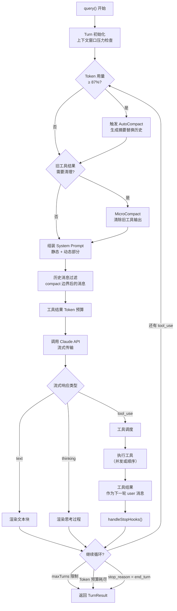

# 第三章：查询引擎与主循环

[← 上一章](02-总体架构.md) | [返回目录](README.md) | [下一章 →](04-系统提示词工程.md)

---

## 3.1 query() 异步生成器

查询引擎的核心是一个名为 `query()` 的异步生成器函数（在压缩代码中标识为 `tt` / `po_`），它编排了每一次 AI 交互的完整生命周期。



## 3.2 Think → Act → Observe 循环

Claude Code 的主循环遵循经典的 **Think → Act → Observe** 模式：

| 阶段 | 实现 | 关键细节 |
|------|------|----------|
| **Think** | 动态 System Prompt 组装 | 每轮重新构建，包含工具规格、目录结构、git 上下文 |
| **Act** | 工具执行引擎 | 支持并发执行、流式工具、批次处理 |
| **Observe** | 工具结果注入 | 结果作为下一轮 user 消息，自动 Token 预算控制 |

核心设计哲学：**"少搭框架，多信模型"**（Less scaffolding, more model）——没有 DAG、没有分类器，模型自己决定下一步做什么。

## 3.3 Token 预算管理

200K 的上下文窗口需要在多个部分之间共享：

```
┌──────────────────────────────────────────────┐
│              200K Token 上下文窗口              │
├──────────────────────────────────────────────┤
│  System Prompt（动态组装）         ~15-25K    │
│  ────────────────────────────────────────     │
│  对话历史（经压缩管理）            ~100-150K   │
│  ────────────────────────────────────────     │
│  工具结果（带预算控制）            ~20-30K     │
│  ────────────────────────────────────────     │
│  响应缓冲区                       ~10-20K     │
└──────────────────────────────────────────────┘
```

`tokenBudget.ts` 实现了客户端预算控制：
- **+500K 自动续期**：当消耗达到预算时自动扩展
- **90% 消耗停止**：接近预算上限时终止循环
- **收益递减检测**：连续低增量被视为收益递减，提前终止

## 3.4 SDK 控制协议

`QueryEngine` 暴露了一套完整的 SDK 控制协议（`controlSchemas.ts`），通过 stdin/stdout 上的 JSON 消息通信：

| 控制消息类型 | 功能 |
|-------------|------|
| `init` | 初始化会话 |
| `interrupt` | 中断当前执行 |
| `can_use_tool` | 工具使用权限查询 |
| `permission_mode` | 权限模式切换 |
| `model` | 模型选择 |
| `mcp_status` | MCP 状态查询 |
| `get_context_usage` | 上下文使用量细分 |
| `rewind` | 回退消息 |
| `cron_task` | 定时任务管理 |
| `elicitation` | 信息引导获取 |

## 3.5 handleStopHooks

每轮结束时 `handleStopHooks` 并行执行多种后处理：

- **Stop** / **SubagentStop** / **TeammateIdle** / **TaskCompleted** 判定
- 可产生 **blocking** 错误阻止续跑
- 触发 prompt suggestion、memory extract
- 触发 **autoDream** 记忆整合
- computer-use 清理

---

[← 上一章：总体架构](02-总体架构.md) | [返回目录](README.md) | [下一章：系统提示词工程 →](04-系统提示词工程.md)
