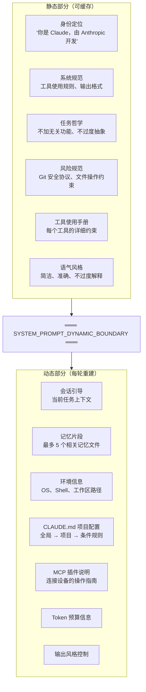

# 第四章：系统提示词工程

[← 上一章](03-查询引擎与主循环.md) | [返回目录](README.md) | [下一章 →](05-工具系统.md)

---

## 4.1 动态组装机制

Claude Code 的 System Prompt 不是一段固定文本，而是由 `getSystemPrompt()` 函数动态拼装的。拼装逻辑分为**静态部分**和**动态部分**，中间由 `SYSTEM_PROMPT_DYNAMIC_BOUNDARY` 标记分隔。



## 4.2 缓存策略与 Token 经济学

这个设计的核心秘密在于**缓存经济学**：

- **边界之上（静态部分）**：内容不变，API 可以完美缓存，实现 **92% 的前缀复用率**
- **边界之下（动态部分）**：每次对话不同，确保环境感知

| 层级 | 内容 | 说明 |
|------|------|------|
| **Prompt 文本层** | System Prompt 文本 | 静态/动态分离 |
| **Schema 请求层** | 工具定义、模型参数 | `_I4 → _X → LZz → hZz` 链 |
| **传输层** | HTTP 请求 | SSE 流式、重试策略 |

## 4.3 CLAUDE.md 分层加载

项目上下文通过 CLAUDE.md 文件注入，遵循分层加载机制：

```
~/.claude/CLAUDE.md          ← 全局配置（用户偏好）
./CLAUDE.md                  ← 项目根配置
./.claude/rules/*.md         ← 条件规则文件
./子目录/CLAUDE.md            ← 子目录特定配置
```

关键细节：CLAUDE.md 的内容被注入到**用户消息**中（包裹在 XML 标签内），而不是 System Prompt 中。这保持了 System Prompt 的稳定性，最大化 prompt cache 命中率。

## 4.4 行为约束体系

**任务哲学**（`getSimpleDoingTasksSection()`）：
- 不要添加用户没要求的功能
- 不要过度抽象，不要擅自重构
- 不要乱加注释和文档字符串
- 不要给时间估计
- 方法失败时先诊断原因再换策略
- 结果要如实汇报，不能假装自己测试过了

**工具使用语法**：
- 读文件必须用 FileRead，不许用 cat/head/tail
- 改文件必须用 FileEdit，不许用 sed/awk
- 没有依赖关系的工具调用必须并行处理

**Git 安全协议**：
- 绝不擅自 git push --force 或 reset --hard
- 总是创建新 commit 而不是 amending
- 不要跳过 hooks（--no-verify）

---

[← 上一章：查询引擎与主循环](03-查询引擎与主循环.md) | [返回目录](README.md) | [下一章：工具系统 →](05-工具系统.md)
