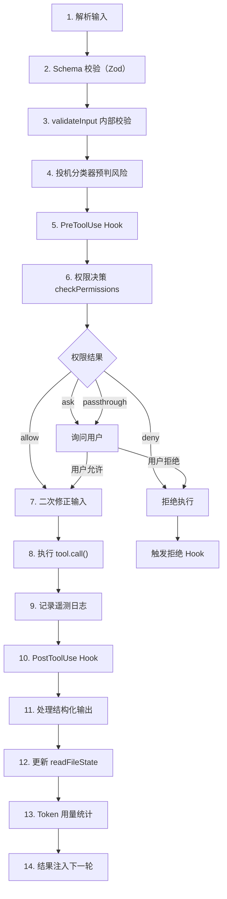
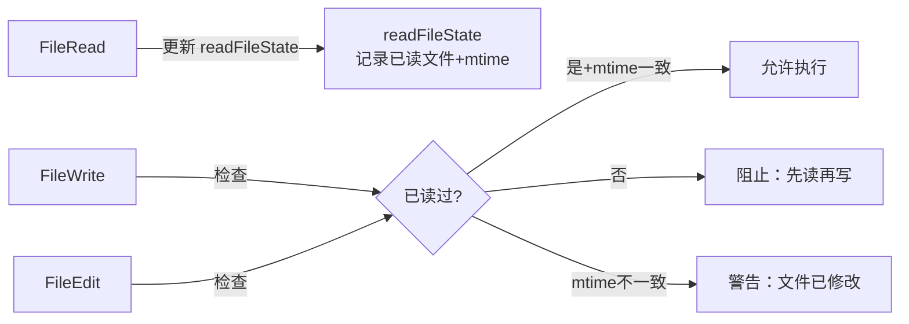

# 第五章：工具系统

[← 上一章](04-系统提示词工程.md) | [返回目录](README.md) | [下一章 →](06-多Agent蜂群架构.md)

---

## 5.1 工具类型契约

每个工具遵循严格的 `Tool` 接口契约：

```typescript
interface Tool {
  name: string;
  isMcp: boolean;
  alwaysLoad: boolean;
  shouldDefer: boolean;        // 延迟加载以节省 Token
  inputSchema: ZodSchema;
  outputSchema?: ZodSchema;
  isEnabled(): boolean;
  isConcurrencySafe: boolean;  // 默认 false（Fail-closed）
  isReadOnly: boolean;         // 默认 false（Fail-closed）
  isDestructive: boolean;
  checkPermissions(): PermissionDecision;
  call(input, context): ToolResult;
  toAutoClassifierInput(): ClassifierInput;
}
```

**Fail-closed 设计**：`isConcurrencySafe` 和 `isReadOnly` 默认都是 `false`，忘了声明安全属性的工具会被视为"有风险、会写入"。

## 5.2 42 个工具一览

| 类别 | 工具 | 说明 |
|------|------|------|
| **文件操作** | FileRead, FileWrite, FileEdit | 读前写约束、mtime 一致性 |
| **搜索** | Grep, Glob, ToolSearch | ripgrep 替代 RAG |
| **执行** | Bash, SleepTool | 沙箱隔离、超时控制 |
| **代理** | Agent (Task), TodoWrite | 子代理生成、任务管理 |
| **Web** | WebFetch, WebSearch | 网页抓取、搜索 |
| **笔记本** | NotebookRead, NotebookEdit | Jupyter 支持 |
| **MCP** | MCPTool | 动态工具协议 |
| **计划** | EnterPlanMode, ExitPlanMode | 计划模式切换 |
| **定时** | CronCreate, CronDelete, CronList | KAIROS |
| **其他** | LSPTool, MemoryTool 等 | IDE 集成、记忆管理 |

## 5.3 14 步工具执行治理流水线



## 5.4 核心工具详解

### BashTool —— 沙箱机制

```
┌─ BashTool 安全层 ──────────────────────────────┐
│  超时控制 / Assistant 模式限制 15 秒              │
│  沙箱隔离：Linux bwrap / macOS sandbox-exec      │
│  CWD 追踪：Shell.ts 核心工作目录管理             │
│  禁止滥用 sleep，引导使用 SleepTool               │
└────────────────────────────────────────────────┘
```

### FileRead / FileWrite / FileEdit —— 读前写约束



## 5.5 ToolSearch 延迟加载

42 个工具不全部加载，标记 `shouldDefer` 的工具通过 ToolSearch 按需注入：

1. 模型判断需要某工具 → 调用 ToolSearch
2. `select:name` 精确加载或模糊打分
3. 匹配结果作为 `tool_reference` 注入上下文
4. 后续轮次可使用该工具

---

[← 上一章：系统提示词工程](04-系统提示词工程.md) | [返回目录](README.md) | [下一章：多Agent蜂群架构 →](06-多Agent蜂群架构.md)
