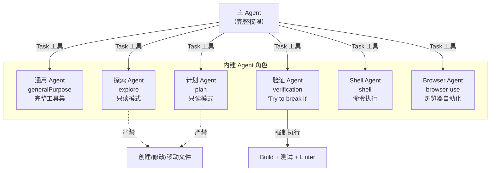
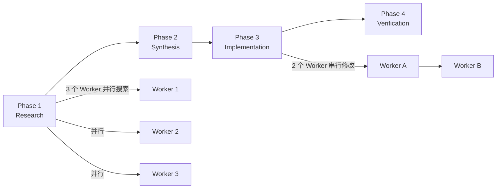

# 第六章：多Agent蜂群架构

[← 上一章](05-工具系统.md) | [返回目录](README.md) | [下一章 →](07-上下文管理与压缩.md)

---

## 6.1 六个内建 Agent

## 6.2 角色隔离原则

**Explore Agent 和 Plan Agent** 被设计为纯只读模式：
- 不能创建、修改或移动文件
- Bash 工具限制为 `ls`、`git status` 等安全操作
- 计划和实现彻底分离

**反偷懒机制**：
- 主 Agent 派发任务时**禁止**写模糊指令，必须给出具体路径和行号
- 子 Agent 启动时被注入指令："你是一个被 Fork 出来的工人，不是经理。不要交流提问，直接使用工具干活，严禁再生成子 Agent。"

## 6.3 Coordinator 协调器模式

通过 `CLAUDE_CODE_COORDINATOR_MODE` 环境变量和 GrowthBook `COORDINATOR_MODE` 功能开关控制。

## 6.4 Verification Agent

Verification Agent 的核心目标被完全逆转为 **"Try to break it"**：

- 强制运行 Build、测试套件、Linter 和类型检查
- 前端改动 → 浏览器自动化验证
- 后端改动 → curl 实测响应
- 主动进行对抗性探测（Adversarial probes）
- 最终判决：PASS / FAIL / PARTIAL
- 与写代码的 Agent 利益彻底隔离

## 6.5 Fork 缓存优化

所有 Fork 子 Agent 统一使用相同的文本前缀 `'Fork started — processing in background'`，利用字节级前缀匹配让后续子 Agent 复用第一个的缓存，大幅削减成本。

---

[← 上一章：工具系统](05-工具系统.md) | [返回目录](README.md) | [下一章：上下文管理与压缩 →](07-上下文管理与压缩.md)
