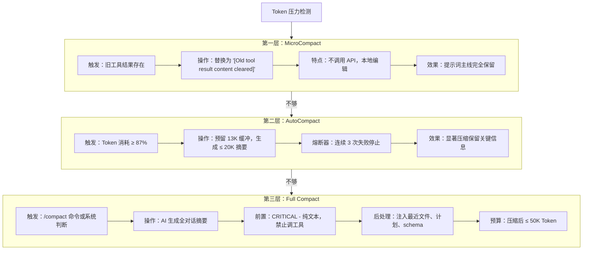
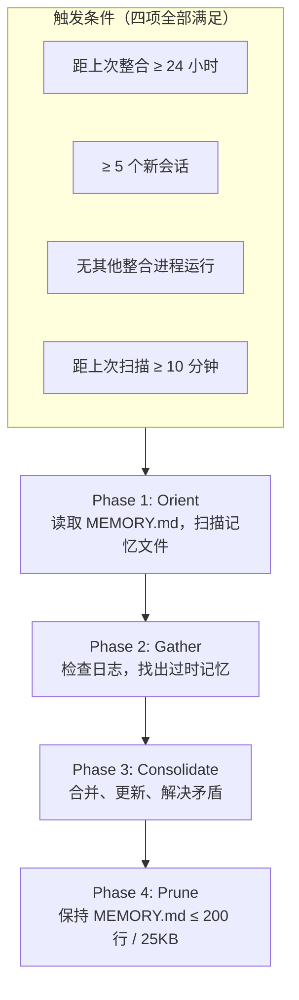

# 第七章：上下文管理与压缩

[← 上一章](06-多Agent蜂群架构.md) | [返回目录](README.md) | [下一章 →](08-权限与安全.md)

---

## 7.1 三层压缩机制



## 7.2 记忆系统

**双模型协同检索**：调用快速 AI 模型（如 Claude Sonnet）扫描所有记忆文件标题和描述，选出最多 5 个最相关的记忆注入上下文。策略是"精确度优先于召回率"。

记忆层级：

```
~/.claude/MEMORY.md         ← 全局记忆
./.claude/memory/*.md       ← 项目级记忆
./.claude/sessions/*.json   ← 会话记录
```

早期版本使用 Voyage embeddings 的 RAG 方案已被放弃，替换为 ripgrep 代理式搜索。

## 7.3 autoDream / KAIROS 夜间记忆蒸馏



AI 在低活跃期"睡觉"时，将原始日志蒸馏压缩成结构化的"用户偏好"和"项目背景"文件——仿生学意义上的记忆巩固。

---

[← 上一章：多Agent蜂群架构](06-多Agent蜂群架构.md) | [返回目录](README.md) | [下一章：权限与安全 →](08-权限与安全.md)
