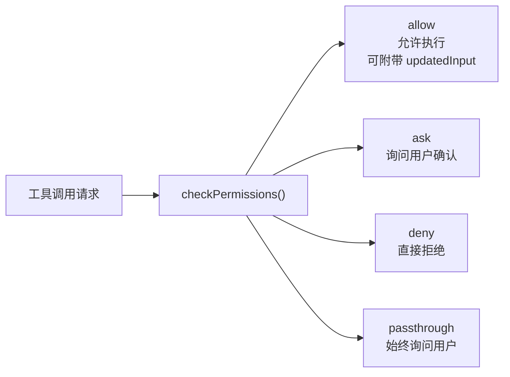
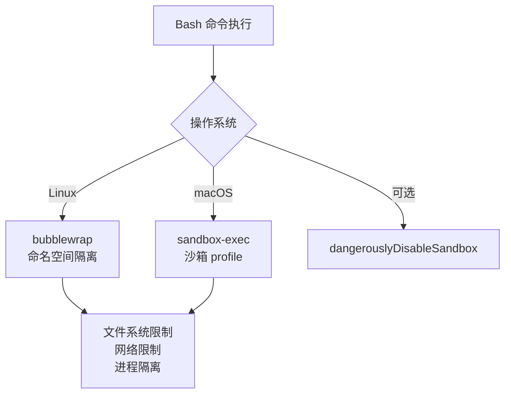

# 第八章：权限与安全

[← 上一章](07-上下文管理与压缩.md) | [返回目录](README.md) | [下一章 →](09-生态系统.md)

---

## 8.1 权限决策模型



权限决策链路中包含**自动分类器**（`toAutoClassifierInput()`），对工具调用进行风险预判。

## 8.2 Hook 系统

104 个 React Hooks + 运行时 Hook 事件互补：

| 类型 | 位置 | 代表性 Hook |
|------|------|------------|
| **运行时 Hook** | query() 循环 | InstructionsLoaded, UserPromptSubmit, PreToolUse, PostToolUse, PostCompact |
| **React Hook** | UI 组件 | useCommandQueue, useToolPermission, useSwarm, useRemoteSession |

Hook 四阶段时序：

```
1. sj() → Di6() InstructionsLoaded     ← 指令加载完成
2. AU8 → ihz → qe1() UserPromptSubmit  ← 用户输入提交
3. tool_use → qs1() PreToolUse          ← 工具使用前
4. permission core → PermissionRequest  ← 权限请求
```

## 8.3 沙箱机制



## 8.4 Undercover Mode

当 Anthropic 员工（`USER_TYPE === 'ant'`）使用 Claude Code 向开源项目贡献代码时，Undercover Mode 自动启用：

- 在 git 提交中隐藏 AI 工具使用痕迹
- 移除 Anthropic 相关元数据
- 防止内部模型代号和功能名称泄漏

---

[← 上一章：上下文管理与压缩](07-上下文管理与压缩.md) | [返回目录](README.md) | [下一章：生态系统 →](09-生态系统.md)
