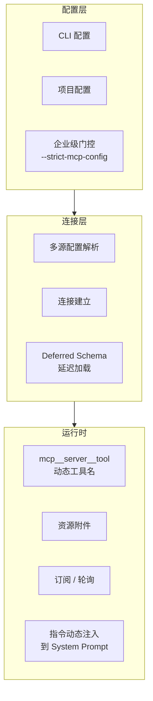
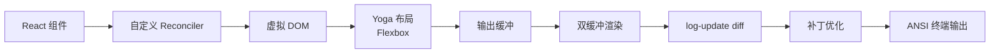

# 第九章：生态系统

[← 上一章](08-权限与安全.md) | [返回目录](README.md) | [下一章 →](10-隐藏功能与彩蛋.md)

---

## 9.1 MCP 协议集成

MCP 设备连接时，附带的操作指南会被动态拼接到 System Prompt 中。

## 9.2 三套扩展机制

| 机制 | 特点 | 能力 |
|------|------|------|
| **Skill** | 轻量工作流 | 基于 Markdown，声明 allowed-tools，强制模型匹配时调用 |
| **Plugin** | 重型插件 | 深度系统控制，自定义命令，可接管模型行为 |
| **Workflow** | 工作流编排 | 多步骤编排，条件分支，与 Hook 联动 |

命令注册顺序：`bundled skills → builtin plugin skills → skill 目录 → workflow → plugin`

## 9.3 Bridge 远程会话

四条远程路径：

| 路径 | 模式 | 说明 |
|------|------|------|
| `--remote-control` | 本地会话对外 bridge | 将本地会话暴露给远端 |
| `--remote` | 远端 session 前端 | 连接远端会话 |
| `--sdk-url` + headless | SDK transport | SDK 传输通道 |
| `useDirectConnect` | 裸 WebSocket | IDE 直连 |

Bridge V1 基于 Environments API + 轮询；V2 为 env-less，受 GrowthBook 门控。

## 9.4 TUI 终端界面

渲染节流约 16ms（≈60fps），提供焦点管理、文本选择、搜索 overlay、alt-screen、鼠标追踪等功能。

---

[← 上一章：权限与安全](08-权限与安全.md) | [返回目录](README.md) | [下一章：隐藏功能与彩蛋 →](10-隐藏功能与彩蛋.md)
